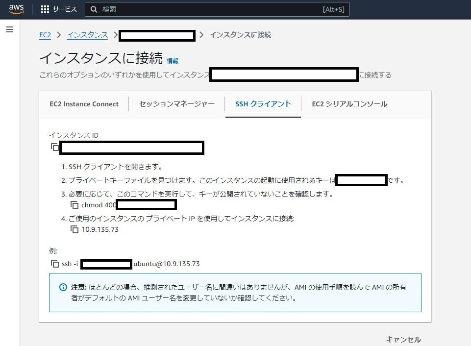
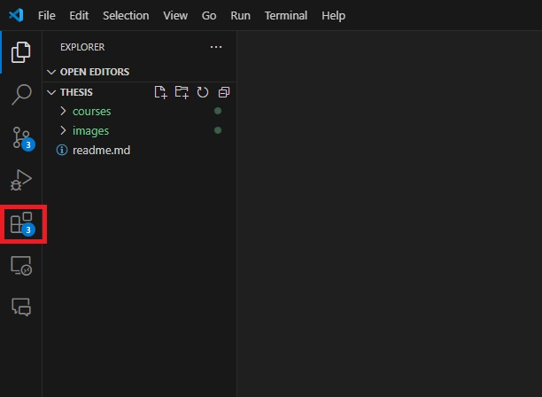

# 第3回

# 開発環境

# ssh(secure shell)

仮想マシンやAWS、GCP、Azureなどのクラウドサービスを利用する場合、sshを利用して開発する必要があります。

## AWSの場合

デフォルトでssh接続が可能になっていますが、公開鍵認証を利用する必要があります。

AWSのコンソールから、`EC2 > インスタンス > [インスタンスID] > 接続 > SSH接続`を選ぶと、接続方法が表示されます。



## OpenSSHの使い方

Windowsの`PowerShell`やCentOSの`Terminal`などのコンソールからssh接続を行うことができます。

```bash
ssh -i <秘密鍵のパス> <ユーザ名>@<IPアドレス>
```

`-i`オプションは秘密鍵へのパスを指定するオプションです。`<ユーザ名>`は接続先のユーザ名、`<IPアドレス>`は接続先のIPアドレスを指定します。

例えば、接続先に`ec2-user`というユーザがいて、IPアドレスが`10.11.12.13`で、秘密鍵が`~/.ssh/mykey.pem`にある場合、以下のように接続します。

```bash
ssh -i ~/.ssh/mykey.pem ec2-user@10.11.12.13
```

また、ssh接続を簡単にするために、`~/.ssh/config`に設定を記述することができます。`~`はユーザのホームディレクトリを表します。

```
Host <ホスト名>
  HostName <IPアドレス>
  User <ユーザ名>
  IdentityFile <秘密鍵のパス>
```

## うまくssh接続できない場合

`-v`オプションをつけると、デバッグ情報を表示することができます。接続できなかった理由を確認してみましょう。

# Node.js

Node.jsは、ゲームやWebアプリケーションなどの開発に利用されるプログラミング言語JavaScriptのサーバーサイド実行環境です。

近年よく利用されているため、インストール方法を紹介します。

## nvm(Node Version Manager)のインストール

Node.jsをインストールするときは、まずNode.jsのバージョン管理ツールであるnvmをインストールします。

[公式のGitHubリポジトリ](https://github.com/nvm-sh/nvm)を参考にインストールします。

```
curl -o- https://raw.githubusercontent.com/nvm-sh/nvm/v0.40.1/install.sh | bash
```

## Node.jsのインストール

次に、nvmを使って最新のNode.jsをインストールします。

```
nvm install --lts
```

## Node.jsのバージョン確認

次のコマンドで、Node.jsのバージョンを確認します。

```
node -v
```

# 統合開発環境（IDE）

制作の過程でプログラミングを行う場合、統合開発環境（IDE）を利用すると便利です。

IDEは、プログラムの作成、実行などの作業を一つのソフトウェアで行うことができます。

IDEにはいくつかの種類がありますが、最もよく利用されている一つに[Visual Studio Code](https://code.visualstudio.com/)があります。

Visual Studio Codeは、Microsoftが提供しているオープンソースのIDEで、多くのプログラミング言語に対応しています。

## 拡張機能 Remote - SSH のインストール

さらに、Visual Studio CodeにはRemote - SSHという拡張機能があり、あたかもローカルで開発しているかのようにリモートのサーバーに接続して開発することができます。

拡張機能をインストールするには、Visual Studio Codeを開いて、左側のアイコンから`拡張機能`を選択し、検索バーに`Remote - SSH`と入力して、拡張機能をインストールします。



[Remote - SSH](https://marketplace.visualstudio.com/items?itemName=ms-vscode-remote.remote-ssh)

インストールが完了したら、Visual Studio Codeを再起動してください。

再起動後、`F1`キーを押してコマンドパレットを開き、`Remote-SSH: Open SSH Host...`を選択します。

表示された入力欄に、`<ユーザ名>@<ホスト名>`または`<ユーザ名>@<IPアドレス>`を入力してエンターキーを押します。パスワードを求められた場合は入力してください。（公開鍵認証を利用することをお勧めします）

接続が完了したら、`ファイル > フォルダを開く`を選択して、リモートのフォルダを開きます。

そうすると、ローカルで開発しているかのように、リモートのサーバー上で開発を行うことができます。

# apacheの使い方

Apacheは、最も利用されているウェブサーバーソフトウェアです。Apacheを使うことで、作成したウェブサイト（HTMLやCSS、JavaScriptなどのファイル）をウェブサーバー上で公開することができます。

## インストール

Ubuntuの場合、以下のコマンドでApacheをインストールできます。

```bash
sudo apt update
sudo apt install apache2
```

## 設定ファイル

### ドキュメントルート

作成したHTMLファイルはApacheのドキュメントルートに配置する必要があります。通常は`/var/www/html`がドキュメントルートとして設定されています。

### sites-available/ フォルダ

`/etc/apache2/sites-available/`は、Apacheの設定ファイルが格納されているディレクトリです。

`000-default.conf`は、デフォルトの設定ファイルです。このファイルの中で、ドキュメントルートやポート番号などの設定を行います。

`default-ssl.conf`は、HTTPS（SSL/TLS）を利用する場合の設定ファイルです。ここにSSL証明書のパスやポート番号などを設定します。

## 設定の反映・再起動

設定ファイルを変更した場合、設定の反映とApacheの再起動が必要です。

```bash
sudo a2ensite <設定ファイル名> # 設定の有効化
sudo systemctl reload apache2 # 設定の反映
```