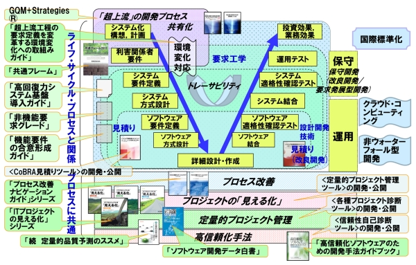

# 第4回
# ソフトウェア開発プロセス

[IPA情報処理推進機構, 信頼性の高いソフトウェアを効率的に開発]

ソフトウェアの開発は一般的に次のようなフェーズで進められます。

1. 要求定義
2. 要件定義
3. 基本設計
4. 詳細設計
5. 実装
6. テスト
7. リリース

卒業制作においても、このプロセスを踏んで開発を進めるとスムーズに進めることができるでしょう。

## 要求定義

ソフトウェアの開発を始める前に、プロジェクトの目的を定義します。クライアントが何を求めているのか、何を実現したいのかを明確にします。

卒業制作においてはクライアントは自分自身ですが、自分が何を実現したいのかを明確にします。

## 要件定義

要求定義で定義した目的を達成するために、具体的にどのような機能が必要かを定義します。

要件定義には、一般的に「機能要件」と「非機能要件」があります。

**機能要件**

具体的な機能の一覧や概要を定義します。

例えば、ユーザー登録、ログイン、ユーザー情報の編集、ユーザー情報の削除などの機能が必要になる場合は、それらをリストアップします。

さらに、ユースケースを明確にします。ユースケースとは、どのような人物が、どのような目的で、どのような手順で、どのような結果を得るかを記述するものです。

UMLモデルにおける、ユースケース図などを記述しても良いでしょう。

**非機能要件**

システムの品質に関連する要件。例えば、パフォーマンス、セキュリティ、使いやすさ、拡張性など、直接的に機能とは関係ないが、求められる品質を定義します。

例えば可用性の高いWebサイトを構築するという場合、システムが応答するまでの時間や、システムが同時に処理できるリクエストの数などが非機能要件になります。

## 基本設計

要件定義で定義した機能を実現するための基本的な設計を行います。

ここでは、システムの全体構造や概念的な設計を行います。

例えば、使用するコンポーネント（Webサーバー、データベース、DNSサーバーなど）や、コンポーネント間の関係、コンポーネントの役割などを定義します。

## 詳細設計

基本設計で定義した概念を、より詳細な設計に落とし込みます。

例えばデータベースのテーブル定義や、WebサーバーのAPI定義などを行います。DNSの設定などもここで行います。

## 実装

詳細設計で定義した内容を元に、実際にソフトウェアを開発します。

例えばオンラインゲームを制作する場合、JavaやC++などのプログラミング言語を使用してコーディングを行います。

OSやミドルウェアのインストール、詳細設計で作成したAPIの実装、データベースの設定などを行います。

## テスト

作成したソフトウェアをテストします。詳細設計で定義した内容が正しく実装されているかを確認してください。

## リリース

開発したソフトウェアを実際にリリースします。インターネットに公開する場合は、ドメインの取得やDNSの設定、SSL証明書の取得などを行います。

# ソフトウェア開発モデル

以上が、基本的なソフトウェア開発のプロセスです。

ソフトウェア開発プロセスには、いくつかのモデルがあり、それぞれのモデルにおいて、上記のプロセスをどのように進めるかが少し異なります。

## ウォーターフォールモデル

ウォーターフォールモデルは、上述のプロセスを順番に進めていくモデルです。

このモデルでは、ウォーターフォールモデルは、各フェーズが連続して完結するように進行し、基本的には前のフェーズに戻ることはありません。

## アジャイルモデル

アジャイルモデルは、ウォーターフォールモデルとは異なり、各フェーズを繰り返し行うモデルです。

このモデルでは、各フェーズを繰り返し行うことで、開発の途中で要件が変更された場合でも、柔軟に対応することができます。

顧客とのコミュニケーションを重視するモデルで、顧客の要求を素早く反映することができます。

しかし、ウォーターフォールモデルと比較して、開発期間が長くなる傾向があります。

顧客の要求が際限なく変更されると、開発が終わらないという問題が発生する可能性があります。

## スクラム

スクラムは、アジャイルモデルの一つで、開発チームが自己組織化され、短い期間で開発を行うモデルです。

スクラムでは、開発チームは、スプリントと呼ばれる短い期間（通常は2週間から1ヶ月）で、開発を行います。

スプリントの開始時には、スプリントで実装する機能を決定し、スプリントの終了時には、その機能が実装されていることを確認します。

