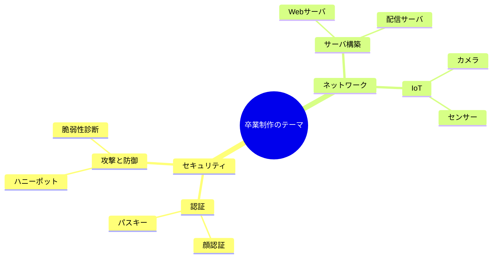
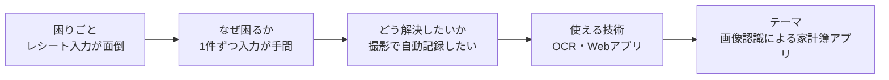
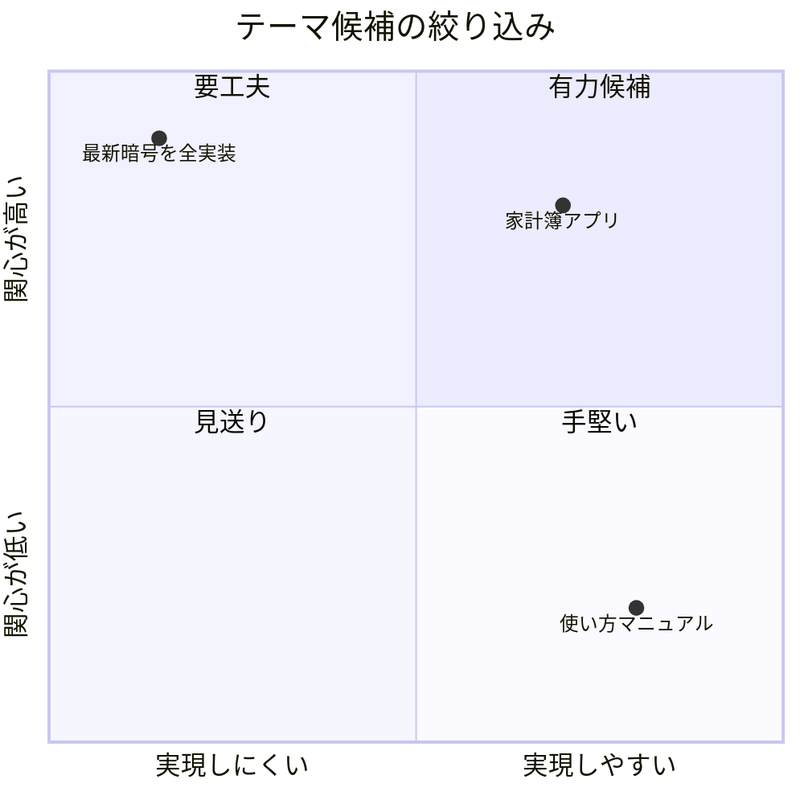

# テーマ決定とグループ編成

## テーマ決定

卒業制作のテーマは、思いつきで「何を作るか」を決めるのではなく、**「何を解決したいのか」「何を確かめたいのか」という問い**から考えると、無理なく決まっていきます。

テーマを見つける入口には、大きく次の3つがあります。自分に合うものから考えてみましょう。

興味のある分野を広げて眺めると、いろいろな切り口が見えてきます。

### テーマの見つけ方（3つの入口）

#### 1. 困りごと・不便から

自分や周りの人が実際に困っていること・不便に感じていることは、そのままテーマの出発点になります。

例えば、こんなふうに考えてみましょう。

1. **困りごと（気づき）**: 毎月のこづかいを管理しようとしても、レシートを手で家計簿に打ち込むのが面倒で続かない。
2. **なぜ困るのか**: レシートの内容を1つずつ入力する手間が大きく、つい後回しにしてしまう。
3. **どう解決したいか**: レシートを撮影するだけで、自動的に家計簿へ記録できるようにしたい。
4. **使えそうな技術**: 画像から文字を読み取るOCR、読み取った内容を集計・保存するWebアプリ。授業で学んだプログラミングやデータベースと結びつける。
5. **テーマ・タイトル**: 「画像認識による家計簿作成 Web アプリケーション」

このように「**困りごと → なぜ困るか → どう解決したいか → 使える技術**」の順に考えていくと、漠然とした思いつきが具体的なテーマに変わります。

同じ流れをたどれる例をもう一つ挙げます。

- 困りごと: 家を空けているあいだ、誰かが侵入していないか不安。
- どう解決したいか: 登録した家族以外の顔を見つけたら、自動でスマホに知らせてほしい。
- 使えそうな技術: カメラの映像から顔を認識するプログラム、通知を送る仕組み。
- テーマ・タイトル: 「顔認証システム付き防犯カメラ」

#### 2. 興味・得意な分野から

これまでの授業で特に面白いと感じた分野や、自分が得意な技術も出発点になります。「もっと深く触ってみたい」「仕組みを自分の手で確かめたい」という気持ちを、そのままテーマにつなげます。

例えば、ネットワークの授業で通信の仕組みに興味を持ったなら、「OSやネットワーク機能を自作して、通信がどう処理されているかを確かめる」といったテーマが考えられます。

#### 3. 先輩の制作を発展させる

過去の卒業制作を見て、「ここをこう改善したい」「別の技術で作り直したい」と感じた点も、立派なテーマになります。先輩の作品がやり残した課題を出発点にすると、目的のはっきりしたテーマになります。

例えば、先輩の防犯カメラがマスクをした顔をうまく認識できなかったのなら、「その認識精度を上げる」ことを自分のテーマにできます。

### 教員おすすめテーマ

テーマが思いつかないときや、教員のサポートを受けながら取り組みたいときは、以下の分野から選ぶこともできます。いずれも担当教員が実務・制作の経験を持ち、深く指導できる分野です。興味があれば気軽に相談してください。

#### WebRTC（リアルタイム通信）

ブラウザ同士でビデオ・音声・データをP2Pでやり取りする技術です。ビデオ通話やP2Pファイル転送などが作れます。SFUサーバの「Janus」や、Go製ライブラリの「Pion」を使った発展的な内容まで指導できます。

- 例: WebRTCを用いたブラウザ間ビデオ通話システムの構築
- 例: Janus（SFU）を用いた多人数ビデオ会議システムの構築

#### WebSocket（双方向リアルタイム通信）

サーバとクライアントが常時つながり、リアルタイムにデータを送り合う技術です。

- 例: WebSocketを用いたリアルタイム共同編集システムの構築
- 例: WebSocketによるサーバ監視ダッシュボードの構築

#### パスキー（WebAuthn / FIDO2）

パスワードを使わない、フィッシングに強い次世代の認証方式です。セキュリティ分野と直結します。

- 例: パスキーを用いたパスワードレス認証システムの構築
- 例: パスワード認証・二段階認証・パスキーの安全性と利便性の比較

#### Unity / NGO（オンラインゲーム）

Unityのネットコード「Netcode for GameObjects（NGO）」を使った、オンラインマルチプレイゲームの制作です。通信同期の仕組みはネットワークの学習と直結します。

- 例: Unity NGOを用いたオンラインマルチプレイゲームの制作
- 例: サーバ権威型設計によるオンラインゲームのチート対策

#### AIを活用したリバースエンジニアリング

LLMなどのAIを使って、プログラムの動作をバイナリから解析する手法の研究です。

- 例: LLMを用いた逆アセンブリコード読解支援ツールの作成
- 例: マルウェア検体の静的解析におけるAIの活用

> **注意**: リバースエンジニアリングは、解析する対象を必ず限定します。**自作プログラム・オープンソース・CTF課題・マルウェア検体**など、解析が許可されたものだけを扱ってください。市販ソフトやゲーム、DRM（コピープロテクト）の解析・回避、リークされたデータの解析は、著作権法や不正競争防止法に触れるため行いません。

### AIと壁打ちしてテーマを見つける

入口を選んでもうまく言葉にできないときは、AI（ChatGPTなどの生成AI）を**壁打ち相手**にして、自分の興味や困りごとを掘り下げていくのが有効です。一人でも、AIが質問を投げ返してくれるので、考えを整理しながらテーマを具体化できます。

**AIに伝えること**

- 自分が興味を持っていること、好きなこと
- これまでの授業で学んだこと、作ったことがあるもの
- 普段の生活で困っていること、不便に感じていること
- 卒業制作に使える期間や、今の自分のスキル

**AIへの頼み方**

大事なのは、**テーマを丸ごと決めてもらうのではなく、考えを引き出してもらう**ことです。例えば、こんなふうに頼みます。

- 「テーマをいきなり決めず、まず私に質問を投げて考えを整理させてください」
- 「私の興味をもとに、テーマの候補をいくつか出して、それぞれの良い点・大変な点を一緒に検討してください」
- 「この案を、ネットワーク・セキュリティの卒業制作として成り立つ形に具体化するには？」

出てきた候補は、上の「3つの入口」や、このあとの「タイトルの付け方」に当てはめて、「それで何を解決するのか・何を確かめるのか」まで具体化します。

**注意すること**

- **主役はあなた自身**です。AIはあくまで相談相手で、最終的に何を作るかは自分で決めます。中身を理解しないまま案を採用しないこと。
- AIの提案は**一般的で無難なものになりがち**です。「自分ならではの角度」や「自分が本当に作りたいもの」を必ず一つ足しましょう。
- AIは、期間や技術的に**実際には難しい案**を、できそうに見せることがあります。実現できるかどうかは、最後に指導教員に相談して確認します。

### 「使い方の説明」で終わるテーマは避ける

「AWSの使い方マニュアル」「Apacheの設定方法まとめ」のような、**既存のツールの使い方を説明するだけ**のテーマは避けましょう。公式ドキュメントや解説記事がすでに世の中にたくさんあり、それを書き写すだけでは、**自分で作ったもの・確かめたことが何もない**からです。卒業制作は「説明する」ではなく、**自分で「作る」「確かめる」**ものです。

大切なのは、題材そのものではなく、**その題材で何を作るか・何を確かめるか**です。同じ題材でも、次のように「制作」や「評価・比較」を足すと、価値のあるテーマになります。

| 弱い（説明で終わる） | 良い（制作・評価がある） |
| --- | --- |
| AWSでWebサーバを立てる手順のマニュアル | 複数のAWSサービスでWebサーバを立て、費用・性能・運用の手間を比較評価する |
| Apacheの設定方法のまとめ | Apacheの設定を変えながら負荷テストを行い、応答速度の変化を測定・比較する |

どちらの「良い」例も、実際に先輩が卒業制作として取り組んだテーマです。「〜の使い方」で止まっていないか、「〜を使って何を作る・確かめるのか」まで踏み込めているかを、いつも確認しましょう。

### テーマの絞り込み

3つの入口からテーマの候補が複数出てきたら、次の3つの観点で絞り込むと決めやすくなります。

- **関心・得意**: 自分が興味を持って続けられるか、これまでの学習で土台があるか
- **実行可能性**: 制作期間内に完成できる規模か、必要な機材や技術に手が届くか
- **具体性**: 「何を作るか」「何を確かめるか」がはっきりしているか

候補を、関心の高さと実現のしやすさで並べてみると、どれに取り組むか判断しやすくなります。

例えば「AIをやってみたい」は、関心としては良いですが漠然としています。これを「レシート画像をOCRで読み取って家計簿を自動作成するWebアプリ」まで具体化すると、作るものがはっきりして実行可能性も判断でき、そのままタイトルにもつながります（実際に先輩が制作したテーマです）。

逆に「最新の暗号技術をすべて実装する」のようなテーマは、関心は高くても制作期間内には収まりません。関心の大きさだけでなく、限られた期間・環境で実現できる規模かどうかも必ず確認しましょう。

### タイトル（テーマ名）の付け方

タイトルは論文の中で最も大事な要素の一つです。読み手が内容を読むかどうかを判断する材料です。「何を・どうやって・何のために」が一読で伝わる具体的なタイトルにしましょう。内容が具体的に伝わるタイトルは、結果として読み手の興味を引きます。

基本の型は「**手法 + 対象 +（目的または評価）**」です。

| 弱いタイトル     | 良いタイトル                                  |
| ---------------- | --------------------------------------------- |
| エアコンシステム | 画像認識による家計簿作成 Web アプリケーション |
| ゲームサーバ構築 | ハニーポットによるサイバー攻撃の観測と分析    |

弱い例は成果物の名前だけで、何をどう作ったのか、何を明らかにしたのかが伝わりません。良い例は手法（画像認識、ハニーポット）と行為（作成、観測・分析）まで読み取れます。

**形容詞や誇張表現でタイトルを飾らないこと**

「革命的な」「最高の」「究極の」といった形容詞・誇張表現は、学術文書では内容の裏付けがないマイナス評価になります。また、興味を引くことを狙いすぎて内容と乖離したタイトルを付けると、読み手の信頼を失います。読み手の興味は、飾った言葉ではなく、具体的な内容で引きつけましょう。

制作物に愛称（例: モールス信号を使ったパスワード認証「MorPa」）を付ける場合は、タイトル本体は内容が伝わる表現とし、愛称はカッコ書きや副題に添えるようにします。

### テーマの提案

アイデアが浮かんだら、それを指導教員と相談します。内容が適切で実行可能かどうかを評価し、必要に応じてアドバイスや提案をします。

内容を指導教員に確認し、問題ないか承認を受けてください

## グループ編成

テーマが決まったら、最大3名のまでグループを編成しましょう。グループ編成の際には、お互いの興味やスキルを考慮して、バランスの取れたチームを作るようにしましょう。

### 自己紹介とスキル共有

自分のスキルや興味、得意分野を共有します。それぞれがどのような役割を担うことができるかを理解し、効果的なチーム作りを進めます。

### 役割分担

自分のスキルとプロジェクトの要件に基づいて各自の役割を分担します。

一人がプロジェクトリーダーとなり、他のメンバーは開発、デザイン、テストなど、プロジェクトのさまざまな側面を担当します。

メンバーの得意分野に基づいて役割を分担し、スムーズにプロジェクトを進めることができるようにします。

### コミュニケーションの確保

チームメンバーは、プロジェクトの進行状況を定期的に共有し、問題が生じた場合には早急に対応できるようにします。

メール、チャットツール、定期的なミーティングなど、コミュニケーションを円滑に行えるツールを選んでください。

### 計画書の提出

アイデアが固まったら、制作を始める前に、これから制作する内容を卒業制作計画書（[テンプレート](../templates/卒業研究計画書テンプレート.md)）にまとめて提出してください。

計画書には、プロジェクトの具体的な内容を書いてください。使用する端末やソフトウェア、構築するシステムのネットワークの構成（IPアドレスや、ルーターの設定など）など詳細に決めておくことで、制作の進行がスムーズになります。
