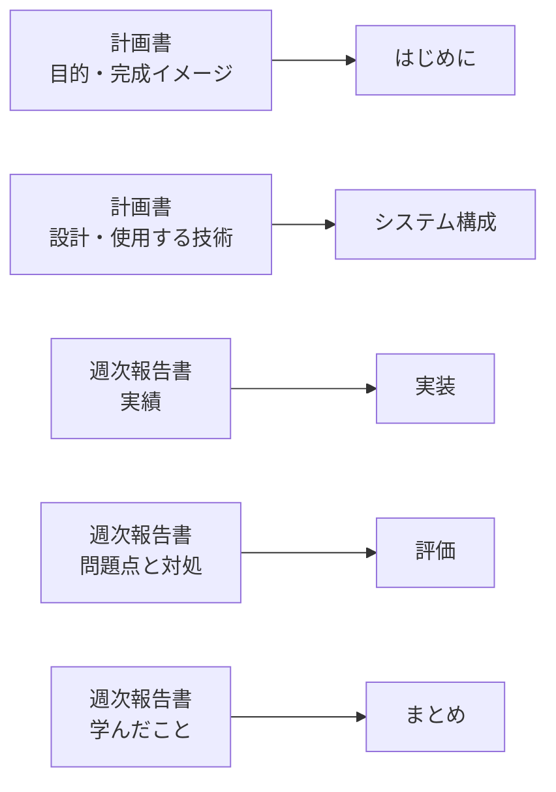
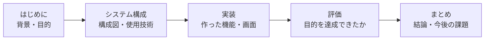

# 卒業論文の執筆

## はじめに

「卒業制作計画書」「週次報告書」を見直し、これまでの制作過程を振り返ってみましょう。

論文は、ゼロから書き始めるものではありません。これまで書いてきた計画書と週次報告書が、そのまま各章の材料になります。

実際に執筆したい内容について、箇条書きで整理してみましょう。例えば、Webアプリケーションを制作した場合、次のような内容が挙げられます。

- 使用した技術　例: HTML, CSS, JavaScript, Python
- 実装した機能　例: ログイン機能, ユーザ認証機能、対戦機能
- 作成した画面　例: ログイン画面, マイページ画面、対戦画面
- 構築したネットワーク構成　例: ネットワーク図

## 卒業論文の構成

卒業論文は、例えば次のような構成になります。

- はじめに
- システム構成
- 実装
- 評価
- まとめ

それぞれの章に、箇条書きであげた内容がどこに該当するかを考えてみましょう。

例えば、実装したログイン機能は「実装」の章に、ネットワーク図は「システム構成」の章に該当します。

システム構成図やシーケンス図などは、[計画立案と要件定義.md](計画立案と要件定義.md) で紹介した Mermaid でも描けます。ただし卒業論文は Word で提出するため、Mermaid で描いた図は画像として書き出してから貼り付けます。

### Mermaid の図を Word に貼る

1. [Mermaid Live Editor](https://mermaid.live) を開く
2. 左側の入力欄に Mermaid のコードを貼り付けると、右側に図が表示される
3. 画面下の Actions から **PNG** または **SVG** を選んでダウンロードする
4. Word の「挿入 → 画像 → このデバイス」で、保存した画像を貼り付ける

拡大しても文字がぼやけない **SVG** が適しています。うまく貼れない場合は PNG を使ってください。PNG は書き出すときに倍率を上げておくと、印刷したときにきれいに出ます。

貼り付けた図には、**図1 システム構成図** のように番号と図名を付けます。そして本文から「システムの構成を図1に示す」のように必ず参照します。

## 制作過程の振り返り

「評価」の章では、構築したシステムが当初の目的を達成できたかどうかを評価します。正しく実装できていることを理論的に示します。

例えば、Webサーバが正しく動作しているかどうかを確認するために、Webサーバにアクセスして、正しく画面が表示されるかどうかを確認します。その過程で「HTTPプロトコル」「シーケンス図」などの理論を用いて、正しく動作していることを示します。

## まとめ

制作の過程で学んだことをまとめます。ただ知識を列挙するだけでなく、制作の過程で課題となったこと、解決したこと、今後の課題などを振り返ります。

プロジェクトが成功した理由について、技術的な課題だけでなく、チームでのコミュニケーション、スケジュール管理、リーダーシップなどのマネジメントについても学んだことがあるはずです。