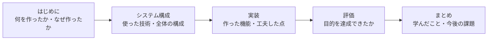

# 研究発表

各グループごとに卒業研究発表を行います。

## 発表の構成

発表は、論文の構成に沿って組み立てると、話す順番で迷いません。

聞き手は、あなたの制作物を初めて見ます。専門用語をそのまま並べるのではなく、何のために作ったのかから話し始めてください。

## 準備しておくこと

- **デモ**: 実際に動かして見せられるようにしておきます。当日の通信環境で動かない場合に備えて、録画も用意しておくと安全です
- **スライド**: 図を中心にします。文字を敷き詰めたスライドは読まれません
- **質疑の想定**: なぜその技術を選んだのか、どこが難しかったのか、はよく聞かれます。答えを用意しておきましょう
- **リハーサル**: 時間内に収まるか、グループで一度通しておきます

## 評価の観点

発表は、[評価基準と評価の観点.md](評価基準と評価の観点.md) で扱った基準に沿って見られます。特に次の2つは、発表でも必ず触れてください。

- **独自性**: 自分たちで考えて工夫した点はどこか
- **評価**: 当初の目的を達成できたことを、どう確かめたか

## 研究発表の目的

### これまでに学んだ知識と職業実践的能力の証明

学んだ知識や技術を実際に適用し、その成果を発表し自分の技術や知識を説明します。

自分が学生生活を通してどのような知識や技術を身につけたのかを発表を通じて証明してください。

### 研究成果を他者に伝える能力を養う

独自のスライドを作成し、研究内容の独自性や優位性を相手に伝える能力を養います。

優れた研究成果も、他者にその成果を存分に伝えることができなければ、その価値は半減してしまいます。

ソフトウェア開発では設計やプログラミングの技術だけでなく、他者に考えを伝える力が求められます。

この発表を通じて、プレゼンテーション力や論理的な説明力を高めましょう。

### 学びの深化

発表を通じて他者からフィードバックを得ることで、自分の研究をより深く理解できます。

他のグループに対しても積極的に質問をしましょう。質問を通じて批判的思考力が養われ、新たな視点を得ることができます。

### コミュニケーション能力の向上

研究内容を分かりやすく伝えるには、明確なプレゼンテーションスキルと論理的な話し方が求められます。

発表の流れを構成したり、相手に伝わる話し方を意識することも、対人コミュニケーションの一環です。

これは社会人としても重要なスキルです。