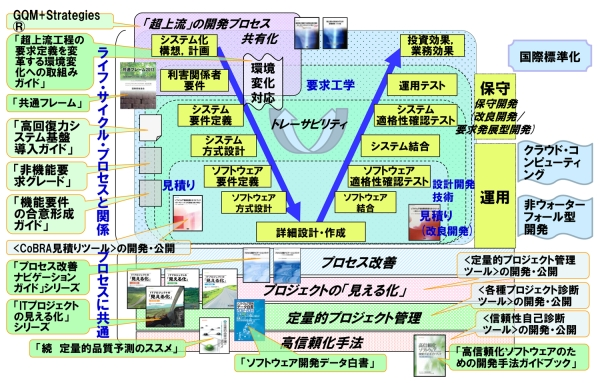

# 計画立案と要件定義

テーマが決まったら、いきなり作り始めるのではなく、まず「何を・どう作り・**どう公開するか**」を計画にまとめます。ここでまとめた内容が、提出する**卒業制作計画書**になります。

[IPA情報処理推進機構, 信頼性の高いソフトウェアを効率的に開発]

## なぜ計画を立てるのか

計画を立てずに作り始めると、次のような行き詰まりが起きがちです。

- 動くものはできたが「これ、どうやって他の人に見せる（公開する）の？」となる
- 途中で使う技術や公開先を変えることになり、作ったものを大きく作り直す
- 必要な機材やサーバを用意していなくて、制作が止まる

こうした手戻りを防ぐために、**完成した姿と、それをどう公開するかを先にイメージし**、必要な技術・環境を洗い出しておきます。

## 完成イメージと公開方法を先に決める

制作物は「作って終わり」ではなく、**誰かに使ってもらえる状態にして初めて完成**です。作り始める前に、次の3つを具体的に決めましょう。

### 完成イメージ

- **誰が**使うのか（一般の人／校内の人／自分たち）
- **どの端末**で使うのか（PCのブラウザ／スマートフォン／専用の機器）
- **どこで**使うのか（インターネット上／校内ネットワークだけ／手元のPC）
- **どう使うのか**の流れ（画面を開く → ログインする → 〇〇する …）

### 公開方法

作ったものをどうやって外に見せるかを決めます。これによって必要な環境が変わります。

- **手元で一時的にデモする**: 発表や動作確認のときだけ公開する。ngrok や Gradio などのトンネルツールを使う
- **常時公開する**: いつでもアクセスできるようにする。VPS・クラウド（AWSなど）やホスティングサービスを使う

具体的な公開ツールや手順は、このあとの [環境構築.md](環境構築.md) の「インターネットへの公開」で扱います。**どの公開方法にするかをここで決めておくと、環境構築のときに何を用意すればよいかがはっきりします。**

### 使用する技術・ツール

制作に使う技術を具体的に決めます。ここで決めた内容が、このあとの環境構築にそのまま直結します。

- **プログラミング言語**（例: Python、JavaScript、Go）
- **フレームワーク・ライブラリ**（例: Flask、Node.js、Gradio）
- **データベース**（例: MySQL、PostgreSQL）
- **サーバ・実行環境**（例: Apache、Docker、VPS）

「なんとなく作れそう」ではなく、**具体的なツール名まで**書き出すことが大切です。名前が挙げられない部分は、まだ調べ足りない部分（＝これから調べるべきこと）だと分かります。

## 開発の進め方（使うツール）を決める

コードをどこで書き、どこで動かし、どう保存・共有するか——この「開発の進め方」も計画の段階で決めておきます。

まだ使ったことのないツールもあると思うので、まずは定番の進め方を紹介します。特にこだわりがなければ、この進め方で計画を立てて構いません。各ツールの詳しい使い方は、このあとの授業で学びます。

- **コードを書く: Visual Studio Code（VSCode）**
  無料で高機能なエディタです。多くのプログラミング言語に対応し、拡張機能も豊富で、まずはこれを使えば間違いありません。
- **サーバ上で開発する: Remote-SSH（VSCodeの拡張機能）**
  手元のVSCodeから、SSHでVPSやクラウド上のサーバにつなぎ、そのサーバ上のファイルを直接編集・実行できます。公開先と同じ環境で、手元で作業する感覚のまま開発できるのが利点です。
- **コードを保存・共有する: git + GitHub**
  変更の履歴を記録し、いつでも前の状態に戻せるツールです。GitHubに置けば、チームで共有したり、複数の端末で同じコードを扱えます。
- **動作を確認する: ブラウザ／コマンド実行**
  Webアプリなら、サーバでプログラムを起動し、ブラウザで表示を確認します。どのコマンドで起動し、どのURL（またはIPアドレス）で確認するかも決めておきましょう。

計画には、次のように「自分たちはどう進めるか」を具体的に書き出します。

> 例: VSCode + Remote-SSH で さくらのVPS 上のファイルを直接編集して開発し、コードは GitHub で管理する。`node server.js` で起動し、ブラウザでアクセスして動作を確認する。

## 作る機能を書き出す（要件定義）

完成イメージを実現するために、「どんな機能が必要か」「どんな品質が求められるか」を具体的に書き出します。これには「機能要件」と「非機能要件」があります。

### どんな機能が必要か（機能要件）

作りたい機能の一覧を書き出します。

例えば、オンラインゲームを制作する場合、以下のような機能をリストアップします。

- ログイン機能
- アカウント情報の編集
- ランキング表示
- チャット機能

さらに、ユースケースを明確にします。ユースケースとは、どのような人物が、どのような目的で、どのような手順で、どのような結果を得るかを記述するものです。UMLのユースケース図を描いてもよいでしょう。

### 品質の目標（非機能要件）

機能そのものではなく、システムに求められる「品質」の目標です。パフォーマンス、セキュリティ、使いやすさ、拡張性など、直接的に機能とは関係ないが求められる品質を書き出します。

例えば、可用性の高いWebサイトを構築する場合、次のような項目が非機能要件になります。

- Webサイトの画面の表示速度は1秒以内
- 同時に最大1000リクエストを処理できる
- サーバーの利用可能時間（稼働率）は99.9%以上

## 設計

要件定義で洗い出した内容を、実際に作れる形に落とし込みます。

### 基本設計

システムの全体構造や概念的な設計を行います。

使用するコンポーネント（Webサーバー、データベース、DNSサーバーなど）や、コンポーネント間の関係、それぞれの役割を定義します。全体の構成を図（構成図）にしておくと、チーム内で認識を合わせやすくなります。

### 詳細設計

基本設計で定義した概念を、より細かい設計に落とし込みます。

例えば、データベースのテーブル定義や、WebサーバーのAPI定義などを行います。DNSの設定などもここで決めます。

## 計画書にまとめる

ここまでで決めた内容を、**卒業制作計画書**にまとめて提出します。

計画書には、プロジェクトの具体的な内容を書いてください。完成イメージ・公開方法・使用する技術に加えて、使用する端末やソフトウェア、構築するシステムのネットワーク構成（IPアドレスや、ルーターの設定など）まで具体的に決めておくことで、制作の進行がスムーズになります。
