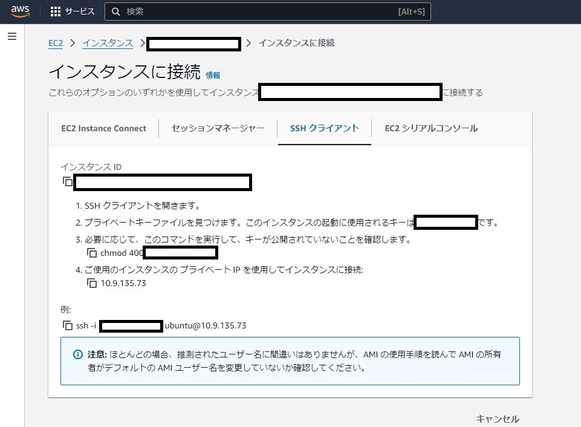
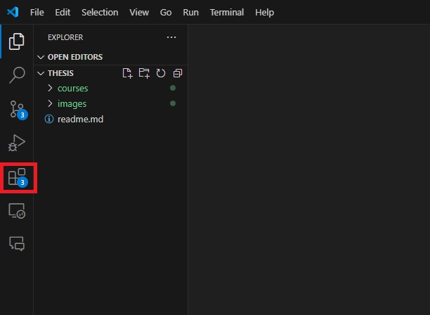

# 開発環境

Webサーバやデータベースなどのソフトウェアを動かす環境を用意し、その上でプログラムを開発します。

この回では、**実行環境の用意**（どこで動かすか）から、開発に使う**道具**（サーバへの接続・エディタ・バージョン管理・Webサーバ）、そして完成したものを**インターネットに公開する**方法までを、まとめて扱います。

この回で学ぶ git は、制作するコードだけでなく、**計画書・スケジュール・週次報告書の管理にも、このあとずっと使います**。

## 実行環境を用意する

必要に応じて仮想環境やクラウドを利用します。以下に、主な方法を紹介します。

### VPS・クラウド

グローバルIPアドレスを持つサーバを借りて、VPSやクラウド上で開発する方法もあります。

VPSとは、Virtual Private Serverの略で、物理サーバー上で動作する仮想サーバを借りることができるサービスです。

- [さくらのVPS](https://vps.sakura.ad.jp/)
- [AWS Lightsail](https://aws.amazon.com/jp/lightsail-vps/)

クラウドとは、インターネット上にあるサーバやストレージなどのコンピュータリソースを、必要なときに必要なだけ利用することができるサービスです。

- [さくらのクラウド](https://cloud.sakura.ad.jp/specification/server-disk/#server-disk-content01)
- [Google Compute Engine](https://cloud.google.com/compute?hl=ja)（e2-micro インスタンス）を 1 か月あたり 1 台無料で利用できます。
- [Amazon EC2](https://aws.amazon.com/jp/ec2/)

どちらもよく似たサービスですが、VPSのほうが比較的安価ですむことが多いです。

Google CloudやAWSでは、一定期間使用できる無料枠がありますので、そちらを利用するのも良いでしょう。

### Dockerコンテナ

Dockerコンテナを使用する方法です。

Dockerとは、Linux上で動作するコンテナ型の仮想化ソフトウェアです。

Dockerコンテナは、小さなLinuxカーネルを持ち、その上で動作するアプリケーションを実行することができます。

近年ではスタートアップ企業や、ベンチャーをはじめとする多くの企業で、Dockerコンテナが使われています。

Dockerのインストール方法は、[Docker公式サイト](https://docs.docker.com/engine/install/centos/)を参照してください。

こちらの方法では、後述のdocker-composeを作成し、gitで管理することで、ほかの端末でも容易に同じ環境を構築することができます。ただし、ほかの端末にもdockerをインストールする必要があります。

### docker-compose

docker-composeは、複数のDockerコンテナを一括で管理するためのツールです。

たとえば、制作物にWebサーバとデータベースが必要な場合、次のように記述することで、Webサーバとデータベースを一括で管理することができます。

WebサーバとしてApache、データベースとしてPostgreSQLを使用する場合の`docker-compose.yaml`ファイルは次のようになります。

```yaml
version: '3.8'
services:
  web:
    image: apache:latest
    ports:
      - "80:80"
    volumes: 
      - ./web:/var/www/html
  db:
    image: postgres:10.18
    container_name: seisaku-db
    hostname: seisaku-db
    volumes:
      - seisaku-postgres:/var/lib/postgresql/data
    environment:
      - POSTGRES_PASSWORD=postgres
      - TZ=Asia/Tokyo
```

docker-compose.yamlファイルを配置したディレクトリで、次のコマンドを実行することで、Webサーバとデータベースを起動することができます。

```bash
$ docker compose up
```

この構成ではファイルを共有するために、`volumes`オプションを使用しています。

`volumes`オプションは、ホストOSのディレクトリをコンテナ内のディレクトリにマウントすることができます。

この例では、ホストOSの`./web`ディレクトリをコンテナ内の`/var/www/html`ディレクトリにマウントしています。

`./web`ディレクトリには、Webサーバの設定ファイルや、Webサーバが配信するファイルを配置します。

このディレクトリ内のファイルを作成・編集することで、Webサーバに反映されます。

また、postgresのデータにアクセスする場合は`docker exec -it seisaku-db psql -U postgres`コマンドを使用します。

この`docker-compose.yaml`ファイルと、プロジェクトで使用するファイルをまとめてgitで管理することで、ほかの端末でも同じ環境を構築することができます。

## サーバへの接続（SSH）

SSHは、ネットワークを介して別のコンピュータに安全に接続し、遠隔操作するためのプロトコルです。通信経路が暗号化されるため、パスワードやコマンドが盗聴される心配がありません。仮想マシンやAWS、GCP、Azureなどのクラウドサービスを利用する場合、SSHを利用して開発するのが一般的です。

### AWSの場合

デフォルトでssh接続が可能になっていますが、公開鍵認証を利用する必要があります。

AWSのコンソールから、`EC2 > インスタンス > [インスタンスID] > 接続 > SSH接続`を選ぶと、接続方法が表示されます。



### OpenSSHの使い方

Windowsの`PowerShell`やCentOSの`Terminal`などのコンソールからssh接続を行うことができます。

```bash
ssh -i <秘密鍵のパス> <ユーザ名>@<IPアドレス>
```

`-i`オプションは秘密鍵へのパスを指定するオプションです。`<ユーザ名>`は接続先のユーザ名、`<IPアドレス>`は接続先のIPアドレスを指定します。

例えば、接続先に`ec2-user`というユーザがいて、IPアドレスが`10.11.12.13`で、秘密鍵が`~/.ssh/mykey.pem`にある場合、以下のように接続します。

```bash
ssh -i ~/.ssh/mykey.pem ec2-user@10.11.12.13
```

また、ssh接続を簡単にするために、`~/.ssh/config`に設定を記述することができます。`~`はユーザのホームディレクトリを表します。

```
Host <ホスト名>
  HostName <IPアドレス>
  User <ユーザ名>
  IdentityFile <秘密鍵のパス>
```

### うまくssh接続できない場合

`-v`オプションをつけると、デバッグ情報を表示することができます。接続できなかった理由を確認してみましょう。

### 困ったときは公式ドキュメントを確かめる

エラーやバグの原因を調べるとき、インターネットで検索することがあります。しかし、ネット上には信頼できる情報とそうでない情報が混在しています。正しい情報を見つけるためには、公式ドキュメントを参照することが重要です。

たとえば、SSHでサーバに接続できないとき、インターネットで検索すると、個人のブログに次のような記事が見つかるかもしれません。

**yoshikiのブログ 2024/10/10**

サーバーに接続できなかったが、次のように書いたら接続できるようになった

```bash
Host yoshiki.com
  HostName 1.1.1.1
  User yoshiki
  IdentityFile ~/.ssh/yoshiki
```

もちろん、目下の問題を解決するためには有用な情報です。しかし、この情報をむやみに信じて設定を変更すると、セキュリティ上の問題が発生する可能性もあります。また、正しく動き始めたとしても、その理由がわからないため、同じ問題が再発する可能性があります。

さらに学びを深めるためには、公式ドキュメントを参照することが重要です。たとえば、SSHの設定については、OpenSSHの公式ドキュメントを参照するとよいでしょう。

OpenSSHの公式ドキュメント

https://man.openbsd.org/ssh_config

たとえば、`IdentityFile`ディレクティブについては、次のように説明されています。

```bash
IdentityFile
Specifies a file from which the user's ECDSA, authenticator-hosted ECDSA, Ed25519, authenticator-hosted Ed25519 or RSA authentication identity is read. You can also specify a public key file to use the corresponding private key that is loaded in ssh-agent(1) when the private key file is not present locally. The default is ~/.ssh/id_rsa, ~/.ssh/id_ecdsa, ~/.ssh/id_ecdsa_sk, ~/.ssh/id_ed25519 and ~/.ssh/id_ed25519_sk. Additionally, any identities represented by the authentication agent will be used for authentication unless IdentitiesOnly is set. If no certificates have been explicitly specified by CertificateFile, ssh(1) will try to load certificate information from the filename obtained by appending -cert.pub to the path of a specified IdentityFile.
Arguments to IdentityFile may use the tilde syntax to refer to a user's home directory or the tokens described in the TOKENS section. Alternately an argument of none may be used to indicate no identity files should be loaded.

It is possible to have multiple identity files specified in configuration files; all these identities will be tried in sequence. Multiple IdentityFile directives will add to the list of identities tried (this behaviour differs from that of other configuration directives).

IdentityFile may be used in conjunction with IdentitiesOnly to select which identities in an agent are offered during authentication. IdentityFile may also be used in conjunction with CertificateFile in order to provide any certificate also needed for authentication with the identity.
```

とりあえずの問題解決には、個人のブログなどの情報も有用ですが、もう一歩踏み込んで学ぶためには、公式ドキュメントを参照することが重要です。

また、linuxには`man`というコマンドがあり、コマンドの使い方や設定ファイルの書式などを確認することができます。たとえば、`ssh_config`の設定ファイルの書式を確認するには、次のようにコマンドを実行します。

```
man ssh_config
```

## 統合開発環境（IDE）

制作の過程でプログラミングを行う場合、統合開発環境（IDE）を利用すると便利です。

IDEは、プログラムの作成、実行などの作業を一つのソフトウェアで行うことができます。

IDEにはいくつかの種類がありますが、最もよく利用されている一つに[Visual Studio Code](https://code.visualstudio.com/)があります。

Visual Studio Codeは、Microsoftが提供しているオープンソースのIDEで、多くのプログラミング言語に対応しています。

### 拡張機能 Remote - SSH のインストール

さらに、Visual Studio CodeにはRemote - SSHという拡張機能があり、あたかもローカルで開発しているかのようにリモートのサーバーに接続して開発することができます。

拡張機能をインストールするには、Visual Studio Codeを開いて、左側のアイコンから`拡張機能`を選択し、検索バーに`Remote - SSH`と入力して、拡張機能をインストールします。



[Remote - SSH](https://marketplace.visualstudio.com/items?itemName=ms-vscode-remote.remote-ssh)

インストールが完了したら、Visual Studio Codeを再起動してください。

再起動後、`F1`キーを押してコマンドパレットを開き、`Remote-SSH: Open SSH Host...`を選択します。

表示された入力欄に、`<ユーザ名>@<ホスト名>`または`<ユーザ名>@<IPアドレス>`を入力してエンターキーを押します。パスワードを求められた場合は入力してください。（公開鍵認証を利用することをお勧めします）

接続が完了したら、`ファイル > フォルダを開く`を選択して、リモートのフォルダを開きます。

そうすると、ローカルで開発しているかのように、リモートのサーバー上で開発を行うことができます。

## AIを活用したコーディング（バイブコーディング）

近年は、AI（生成AI）に作りたいものを自然言語で伝え、コードを書いてもらう開発スタイルが広まっています。これはバイブコーディング（vibe coding）と呼ばれ、2025年に広まった言葉です。うまく使えば、開発のスピードを大きく上げられます。

### 主なツール

- **GitHub Copilot** — VSCodeに組み込んで使えるAIコーディング補助。書いている途中のコードを提案してくれます。GitHubアカウントでサインインすれば無料で使えます（補完・チャットに月ごとの上限があり、超えると翌月まで待つことになります）。なお、学生は GitHub Student Developer Pack の学生認証を通すと、上位版の Copilot Pro を無料で使え、上限が大きく緩和されます。
- **Cursor** — AIを前提に作られたエディタ（VSCodeベース）。プロジェクト全体を理解して、コードの生成や修正ができます。
- **Claude / ChatGPT など** — チャットで相談しながらコードを書いてもらいます。

### 使い方の流れ

1. **具体的に頼む** — 目的・言語・条件をはっきり伝えます。たとえば、PHPで予算を入力すると条件に合う店を一覧表示する機能を書いて、のように頼みます。
2. **生成されたコードを読む** — 何をしているコードなのかを理解します。分からない部分は、AIにその行の意味を尋ねます。
3. **動かして確かめる** — 実際に動かし、期待どおり動くかテストします。
4. **git でコミットする** — 動いたら記録します。

### 使うときの注意（特にセキュリティ）

AIは便利ですが、AIが書いたコードはまだ検証していない下書きだと考えてください。そのまま信じて使うのは危険です。

- **理解せずにコピペしない。** 中身を理解し、発表の質疑応答で自分の言葉で説明できる状態にしておくこと。理解していないコードは、あなたの制作物とは言えません。
- **セキュリティを自分でレビューする。** AIは、脆弱なコード（SQLインジェクションを許すコードなど）、パスワードやAPIキーの直書き、古い・実在しないライブラリの利用などを生成することがあります。ネットワークセキュリティを学ぶあなたたちこそ、生成されたコードの安全性を自分の目で確認しましょう。
- **セキュアな書き方を明示的に頼む。** たとえば、SQLは必ずプレースホルダ（パラメータ化クエリ）を使う、パスワードは bcrypt でハッシュ化する、といった安全な方法を指定して頼むと、より安全なコードが得られます。
- **動作確認とテストは必須。** 動いているように見えても、実は不具合やセキュリティの穴があることがあります。

AIに定型的な部分を任せるのは問題ありません。ただし、自分ならではの工夫こそが評価される部分です（→ [評価基準と評価の観点.md](評価基準と評価の観点.md) の独自性）。AIに丸投げせず、自分で考えた工夫を必ず加えましょう。

## バージョン管理（Git・GitHub）

プロジェクトを進めると、ソースコードや設定ファイル、計画書や週次報告書など、たくさんのファイルを扱います。誰がどのファイルをいつ変更したかを管理し、必要なら以前の状態に戻せるようにするのが「バージョン管理」です。

Gitは、変更履歴を記録・追跡するための分散型バージョン管理システムです。Linuxカーネルのソースコード管理のためにリーナス・トーバルズによって開発され、現在では多くのソフトウェア開発プロジェクトで採用されています。Gitを使うことで、複数人でのソースコードの共有や、変更履歴の管理が容易になります。

Gitで管理したプロジェクトをGitHubなどにアップロードすれば、自分の制作物を公開でき、ポートフォリオとして実力をアピールすることにもつながります。

Gitのインストール方法は、[Git公式サイト](https://git-scm.com/book/ja/v2/使い始める-Gitのインストール)を参照してください。

### リポジトリの初期化

既存のプロジェクトを Git で管理し始めるときは、そのプロジェクトのディレクトリに移動して次のコマンドを実行します。

```bash
git init
```

これを実行すると .git という名前の新しいサブディレクトリが作られ、リポジトリに必要なすべてのファイル (Git リポジトリのスケルトン) がその中に格納されます。

この時点ではまだ、プロジェクト内のファイルは管理対象になっていません。管理を始めたいファイルを `git add` で追加し、`git commit` で記録します。

```bash
git add . # 全てのファイルを追加
git commit -m 'はじめのコミット' # コミットメッセージを記述
```

これで、ファイルの変更履歴を記録することができました。ただし、このままでは変更履歴は自分の端末内にしか保存されません。次の手順で、リモートリポジトリ（GitHubなど）にアップロードします。

### GitHubアカウントを作成する

GitHub にリポジトリを置くには、GitHub のアカウントが必要です（無料で作成できます）。このアカウントは、前に紹介した AI コーディング補助（GitHub Copilot）にサインインするときにも使うので、最初に作っておきましょう。

1. [GitHub](https://github.com/) にアクセスし、Sign up からアカウントを登録します。
2. メールアドレス・パスワード・ユーザー名を入力し、案内に従ってメール認証を済ませます。
3. ユーザー名は公開されるので、制作物のポートフォリオとして見せられる名前にしておくとよいでしょう。

学生認証で Copilot Pro を無料化する場合は、学校のメールアドレスで登録しておくと認証がスムーズです。

### GitHubにリポジトリを作成する

アカウントを作成したら、新しいリポジトリを作成します。画面のガイダンスに従ってリポジトリを作成したら、リポジトリのURLをコピーします。

リポジトリのURLには、`http`と`ssh`の2種類があります。`ssh`を使用する場合は、sshの公開鍵をGitHubに登録する必要があります。設定が難しいと感じる場合は、`http`を使用してください。

先ほど作成したgitプロジェクトを、GitHubにアップロードするために、次のコマンドを実行します。

```bash
git remote add origin <GitHubのリポジトリのURL>
git push -u origin main
```

これで、GitHubにリポジトリが作成され、変更履歴がアップロードされました。

### リモートリポジトリからプロジェクトをダウンロードする

```bash
git clone <GitHubのリポジトリのURL>
```

### リモートリポジトリの変更履歴を取得する

```bash
git pull origin main
```

### 普段の作業の流れ

一度リポジトリを用意したら、あとは次のサイクルを毎回くり返します。

1. **`git pull`** — 作業を始める前に、最新の状態を取り込む（他のメンバーの変更を反映する）
2. ファイルを編集する（コードを書く、計画書や週報を更新する など）
3. **`git add`** — 変更したファイルを、記録する対象に加える
4. **`git commit`** — 変更に説明文（メッセージ）をつけて記録する
5. **`git push`** — 記録をGitHubにアップロードして共有する

毎日の作業は、次の3つのコマンドを覚えれば回ります。

```bash
git add .                        # 変更したファイルをすべて対象に加える
git commit -m "予算での絞り込み機能を追加"   # 変更を記録する（メッセージは具体的に）
git push                         # GitHubにアップロードする
```

> コミットメッセージは「何をしたか」が分かるように具体的に書きます。「修正」より「予算での絞り込み機能を追加」のように書きましょう。

### VSCodeで操作する（コマンドが苦手な人へ）

コマンドに慣れないうちは、上で紹介した VSCode の「ソース管理」パネルから、ボタン操作でも同じことができます。

1. 左のアイコンから「ソース管理」を開く（変更したファイルが一覧に出る）
2. ファイルの横の **＋** を押して、記録する対象に加える（＝ `git add`）
3. 上の入力欄に**メッセージ**を書いて、**コミット**を押す（＝ `git commit`）
4. **変更の同期**（↑↓のアイコン）を押す（＝ `git push` / `git pull`）

### いまの状態を確認する

「どのファイルを変更したか」「まだ記録していないファイルはどれか」を確認するには次を使います。

```bash
git status
```

### チームで使うときの注意

複数人が同じファイルを同時に編集すると、変更がぶつかる「コンフリクト」が起きて、解決が大変になります。慣れるまでは、次を守るとトラブルを減らせます。

- **1人1ファイル**にする（例: 週次報告書は `週報_田中.md` のように分ける）
- 作業を始める前に必ず **`git pull`**、区切りがついたら早めに **`git commit` → `git push`**
- 一度にたくさん変更せず、**こまめにコミット**する

### この授業での使い方

計画書・スケジュール・週次報告書、そして制作するコードは、すべてこのリポジトリで git 管理します。**毎週、作業した内容をコミット・プッシュして提出**します。コミットの履歴が、そのまま作業の記録になります。

## Colab + Gradio + cloudflared で開発・公開する

これまで慣れ親しんできた Google Colab を使えば、環境構築をほとんどせずに、開発から公開までをブラウザだけで完結できます。Python や AI を使った制作に向いた、手軽な開発スタイルの一つです。

1. **Colab で開発する**

   いつものように Colab ノートブックにコードを書きます。必要なライブラリは `!pip install ライブラリ名` で入れられます。

2. **Gradio で操作画面を作る**

   Gradio を使うと、数行のコードで入力・出力のある Web 画面を作れます。AI モデルのデモなどに最適です。

   ```python
   !pip install gradio
   import gradio as gr

   def greet(name):
       return f"こんにちは、{name}さん"

   gr.Interface(fn=greet, inputs="text", outputs="text").launch()
   ```

   実行すると、Colab の中で Web アプリが起動します（通常はポート 7860）。

3. **cloudflared で公開する**

   Colab で動いているアプリに、cloudflared（Cloudflare Tunnel）で公開 URL（HTTPS）を割り当てます。アカウント登録は不要です。Colab で cloudflared を用意し、Gradio が動いているポートを指定して実行します。

   ```bash
   cloudflared tunnel --url http://localhost:7860
   ```

   実行すると `https://～.trycloudflare.com` のような公開 URL が表示され、誰でもアクセスできるようになります。

このスタイルなら、VPS や SSH を用意しなくても、慣れた Colab のまま「作る → 公開する」まで進められます。まずはこの方法で試作し、常に動かし続ける本番環境が必要になったら、上で紹介したサーバ（VPS）を使う方法に進むとよいでしょう。

なお、公開 URL は誰でもアクセスできます。この回の最後の「インターネットへの公開」にあるセキュリティ上の注意（認証をかける・使い終わったら止める など）も必ず確認してください。

## Webサーバ（Apache）

Apacheは、最も利用されているウェブサーバーソフトウェアです。Apacheを使うことで、作成したウェブサイト（HTMLやCSS、JavaScriptなどのファイル）をウェブサーバー上で公開することができます。

### インストール

Ubuntuの場合、以下のコマンドでApacheをインストールできます。

```bash
sudo apt update
sudo apt install apache2
```

### 設定ファイル

#### ドキュメントルート

作成したHTMLファイルはApacheのドキュメントルートに配置する必要があります。通常は`/var/www/html`がドキュメントルートとして設定されています。

#### sites-available/ フォルダ

`/etc/apache2/sites-available/`は、Apacheの設定ファイルが格納されているディレクトリです。

`000-default.conf`は、デフォルトの設定ファイルです。このファイルの中で、ドキュメントルートやポート番号などの設定を行います。

`default-ssl.conf`は、HTTPS（SSL/TLS）を利用する場合の設定ファイルです。ここにSSL証明書のパスやポート番号などを設定します。

### 設定の反映・再起動

設定ファイルを変更した場合、設定の反映とApacheの再起動が必要です。

```bash
sudo a2ensite <設定ファイル名> # 設定の有効化
sudo systemctl reload apache2 # 設定の反映
```

## インターネットへの公開

制作したものを他の人に見せたり試してもらったりするには、インターネットに公開する必要があります。中間発表でデモを見せる、友人にテストしてもらう、といった目的に応じて、手軽な方法から本格的な方法までいくつかの選択肢があります。

### 1. 一時的に公開する（トンネル）

自分のPC（localhost）で動かしているアプリを、そのまま外部からアクセスできるようにする方法です。手元で動かしたままURLを配れるので、デモやテストに向いています。

- **ngrok**: localhostに公開URLを割り当てる定番ツールです。無料でも固定のURLを1つ使えますが、1回の接続が2時間まで、通信量が月1GBまで、といった制限があります。
- **Cloudflare Tunnel（TryCloudflare）**: 以下の1コマンドで、アカウント登録なしに無料でHTTPSの公開URLを作れます。ngrokの有力な代替です。

```bash
cloudflared tunnel --url http://localhost:3000
```

### 2. AIデモを手軽に公開する（Python）

Pythonで作ったAIや機械学習のプログラムを、Webページ付きで手軽に公開できるツールがあります。

- **Gradio**: 数行のコードで入力・出力のあるWeb画面を作れるライブラリです。`launch(share=True)`と書くだけで`xxxx.gradio.live`のような公開URLが発行されます。処理は自分のPC上で動き、リンクは1週間有効です。
- **Streamlit / Hugging Face Spaces**: Streamlitも同様にPythonでWebアプリを作れるライブラリで、Hugging Face Spacesを使えばGradioやStreamlitのアプリを無料で常時公開できます。

### 3. 本格的に公開する（ホスティング）

常時稼働させて誰でもアクセスできるようにするには、ホスティングサービスを利用します。無料枠のあるサービスも多くあります。

- **静的サイト（HTML/CSS/JS）**: GitHub Pages、Cloudflare Pages、Netlify など
- **アプリケーション**: Render、Railway、Fly.io など
- **AIアプリ**: Hugging Face Spaces

前述のVPSやクラウド（AWSなど）にApacheを立てて公開する方法も、この「本格的に公開する」に含まれます。

### 公開するときのセキュリティ上の注意

トンネルやGradioの共有URLは、**インターネットに直接アプリをさらすことになります**。つまり、リンクを知っている人は誰でもアクセスでき、場合によってはプログラムを操作できてしまいます。

- 公開する内容にパスワードや個人情報を含めない
- 必要に応じてログイン認証をかける
- 使い終わったら、公開（トンネル）を必ず停止する

これらを徹底し、意図しない情報漏洩や不正アクセスを防ぎましょう。
