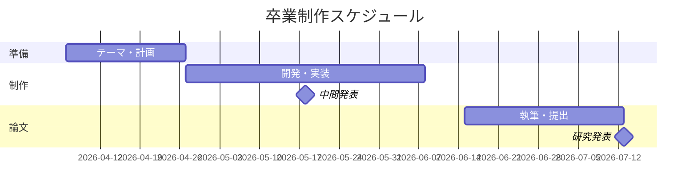

# 卒業制作 スケジュール

令和◯◯年度 卒業制作 ／ Network Security section

- グループ名:
- メンバー:

> このスケジュールはリポジトリ内に置き、制作の進み方に合わせて**毎週更新**します。更新したら git でコミットして、計画の変化を記録に残しましょう。
> 各週の「マイルストーン」は全体で決まっている予定です。それを踏まえて「予定」を自分たちで書き、実際にやったことを「実績」に書きます。予定と実績のズレは、週次報告書でも振り返ります。
> チェックボックス `- [ ]` は、終わったら `- [x]` にします。

## 全体像（例）

制作全体の流れをガントチャートで示すと、次のようになります。日付は例です。

## 記入例（第3週）

### 第3週（4/21 〜 4/27）マイルストーン: 開発環境

**予定**

- [x] VPSを契約する
- [x] Apacheを導入する
- [ ] GitHubにリポジトリを作成する

**実績**

- VPS契約・Apache導入は完了。GitHub連携は認証で詰まり、来週にまわす。

---

## スケジュール

### 第1週（　/　 〜 　/　）マイルストーン: オリエンテーション／テーマ検討

**予定**

- [ ]

**実績**

-

### 第2週（　/　 〜 　/　）マイルストーン: テーマ決定・グループ編成

**予定**

- [ ]

**実績**

-

### 第3週（　/　 〜 　/　）マイルストーン: 開発環境（VPS・SSH・VSCode・Git・Apache・公開）

**予定**

- [ ]

**実績**

-

### 第4週（　/　 〜 　/　）マイルストーン: 計画立案・要件定義／**計画書・スケジュール提出**

**予定**

- [ ]

**実績**

-

### 第5週（　/　 〜 　/　）マイルストーン: 評価基準と評価の観点／中間発表の準備

**予定**

- [ ]

**実績**

-

### 第6週（　/　 〜 　/　）マイルストーン: **中間発表**

**予定**

- [ ]

**実績**

-

### 第7週（　/　 〜 　/　）マイルストーン: 制作

**予定**

- [ ]

**実績**

-

### 第8週（　/　 〜 　/　）マイルストーン: 制作

**予定**

- [ ]

**実績**

-

### 第9週（　/　 〜 　/　）マイルストーン: 制作

**予定**

- [ ]

**実績**

-

### 第10週（　/　 〜 　/　）マイルストーン: 制作

**予定**

- [ ]

**実績**

-

### 第11週（　/　 〜 　/　）マイルストーン: 卒業論文の執筆

**予定**

- [ ]

**実績**

-

### 第12週（　/　 〜 　/　）マイルストーン: 制作・論文の加筆修正

**予定**

- [ ]

**実績**

-

### 第13週（　/　 〜 　/　）マイルストーン: **論文の一次提出**

**予定**

- [ ]

**実績**

-

### 第14週（　/　 〜 　/　）マイルストーン: 論文の最終手直し・**最終提出**

**予定**

- [ ]

**実績**

-

### 第15週（　/　 〜 　/　）マイルストーン: **研究発表**

**予定**

- [ ]

**実績**

-

### 第16週（　/　 〜 　/　）マイルストーン: 予備・総括

**予定**

- [ ]

**実績**

-
